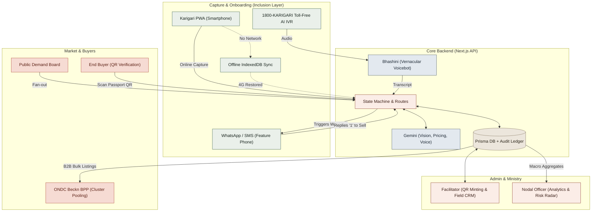
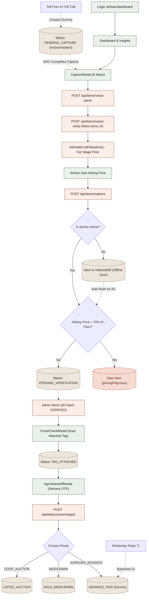
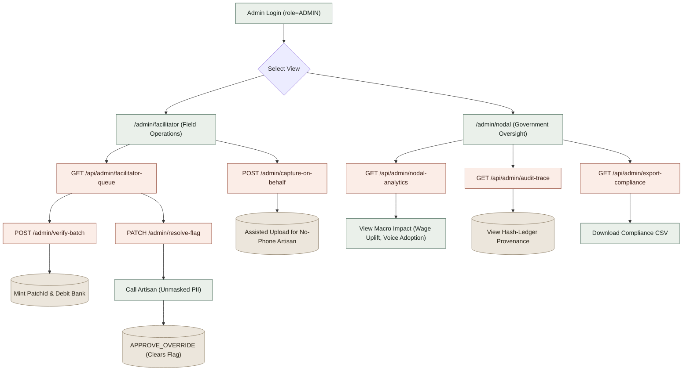
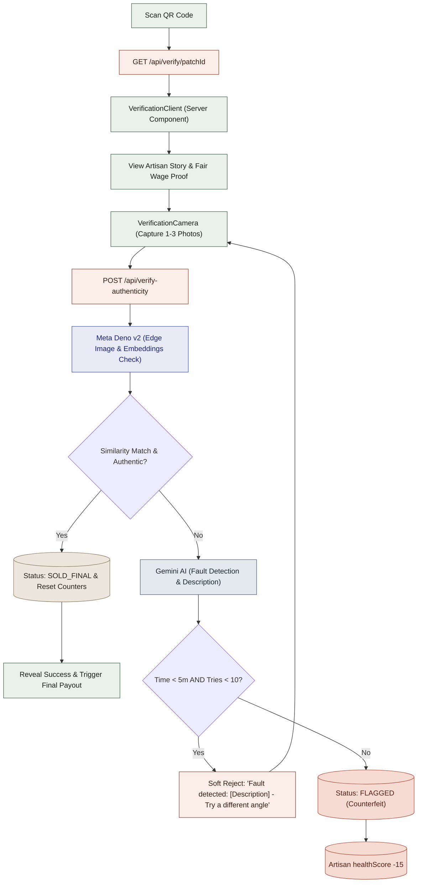
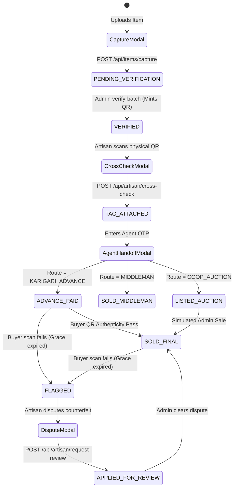
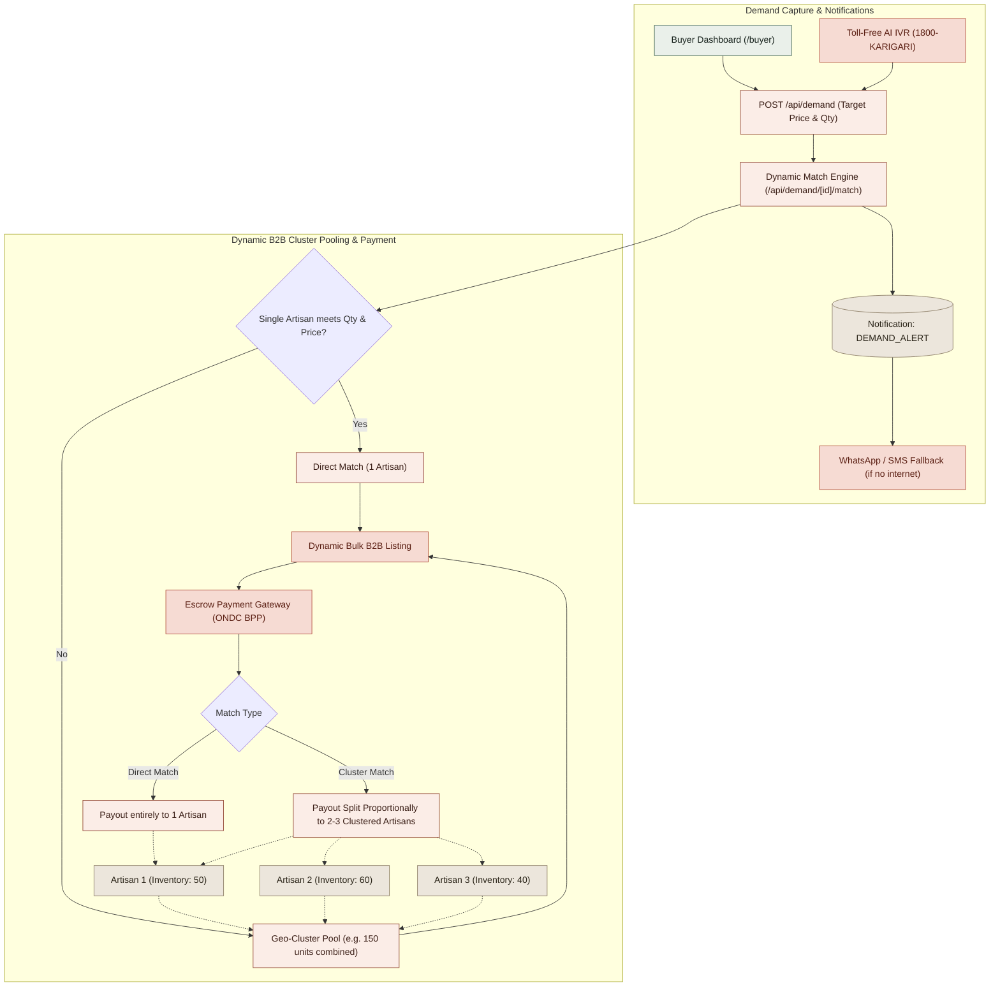

# KARIGARI — Master System Flowcharts

> **Note:** These flowcharts are strictly modeled after the exact state transitions and architectural boundaries defined in the official WORKFLOW.md, incorporating the core Next.js routing, AI logic, and the Advanced SIH resilience layers.

---

## 1. The Overall Master Architecture

This high-level flowchart shows the interconnected flow of data from the initial rural upload, through government oversight, and ultimately to the final buyer and ONDC wholesale markets.

---

## 2. Artisan End-to-End Workflow

This chart tracks an artisan's exact path through the UI (/artisan/dashboard), incorporating the 6-step capture, pricing guards, handoff, and the new offline/telecom fallbacks.

---

## 3. Admin Workflow (Facilitator vs Nodal)

The system splits admin tasks strictly by operational scope: Field actions with PII (Facilitator) vs Government macro-oversight without PII (Nodal).

---

## 4. Buyer Authentication Workflow

The exact sequence when a consumer scans a physical QR code (Public route, no authentication required).

---

## 5. The Interconnected Modal State Machine

Every modal in the UI strictly maps to a single CraftItem status transition.

---

## 6. ONDC B2B Cluster Pooling & Demand Notification

How individual items are aggregated for massive wholesale orders, and how demand filters down.

